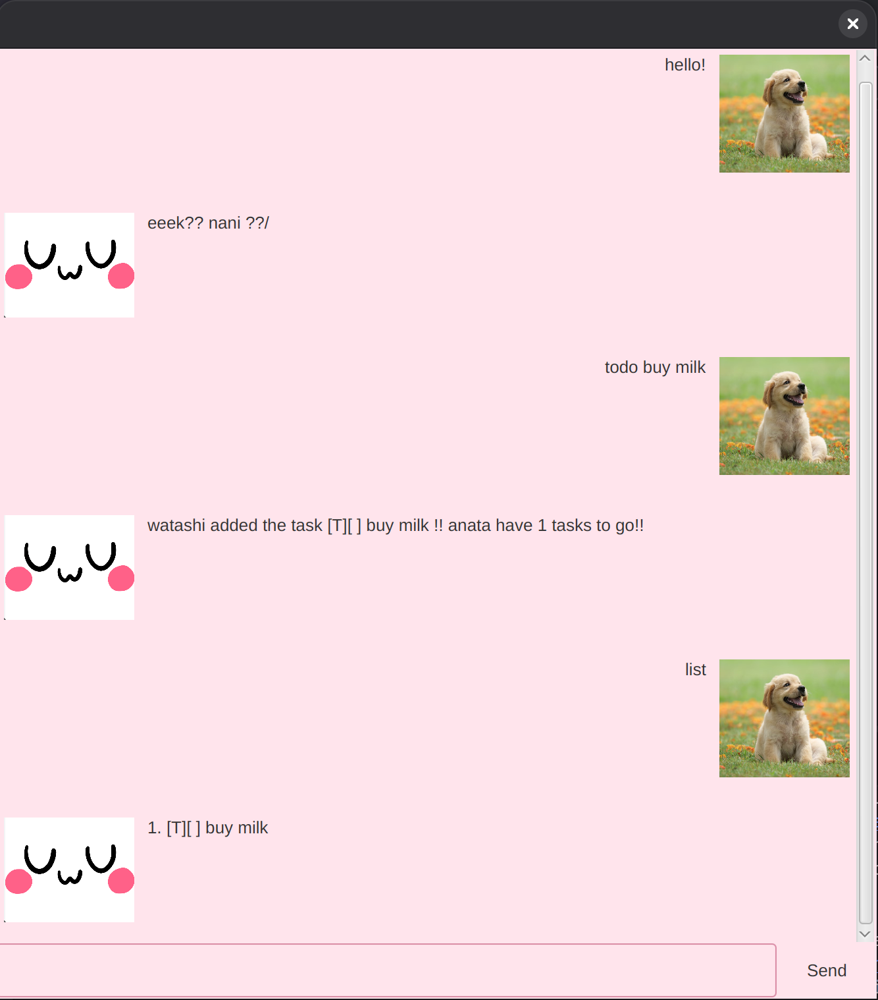

# UwU User Guide



UwU helps you manage all your tasks, helping you keep track of 
what you need to do and where you need to go. You can easily keep 
track of whether the task is complete or not.
Comes with a funny personality :)

## Adding deadlines

Add tasks that have deadlines attached to them.

**Format**: `deadline {task name} /by {deadline}` 
- Deadline must be in yyyy-MM-dd format

**Example**: `deadline math assignment /by 2026-10-10`

This will add a Deadline task called math assignment
with deadline 10 October 2026
into your task list.

Expected output:

```
oh no scary deadlinw.... math assignment
```

## Adding todos

Add tasks that have no deadlines. 

**Format**: `todo {task name}`

**Example**: `todo buy milk`

This will add a Todo task called buy milk into your task list.

Expected output:

```
watashi added the task buy milk !!
```


## Adding events

Add tasks that have a start and end date.

**Format**: `event {task name} /from {start_date} /to {end_date} `

**Example**: `event japan holiday /from 2026-10-10 /to 2026-12-12`

This will add an Event task called "japan holiday"
starting on 10 October 2026 and ending on 12 December 2026 into your task list.

Expected output:

```
yeeeeees event japan holiday added
```

## Listing tasks

Show all tasks in your task list.

**Format**: `list`

**Example expected output**:

```
1. [T][X] Buy milk
2. [D][ ] submit report (by: Sep 1 2026)
```

## Deleting tasks

Delete tasks at the given indices from the task list.

**Format**: `delete {indices}`
- indices must be space separated

**Example**: `delete 1`

Expected output: 

```
!!! begone you normie!!
```

## Finding tasks

Search for a task with a specific keyword.

**Format**: `find {search string}`

**Example**: `find milk`

Expected output:

```
here's all the matching stuffs :PP
1. [T][X] buy milk
```

## Sorting tasks

Sorts tasks by date (deadline or event start date) in 
chronological order.

**Format**: `sort`

**Expected output**:

```
sorted by date :3
```

## Mark tasks

Marks tasks at the given indices as done.

**Format**: `mark {indices}`
- indices must be space separated

**Example**: `mark 1`

Expected output:
```
marked item 1 :D
```

## Unmark tasks

Marks tasks at the given indices as undone.

**Format**: `unmark {indices}`
- indices must be space separated

**Example**: `unmark 1 2 4`

Expected output:
```
unmarked items :PPP
```

## Exit program

Exits the application

**Format**: `bye`